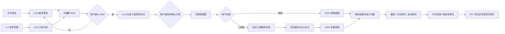

# 3D 创作 Agent 架构（M1.14a–M1.15a）

## 产品定位

“3D 创作 Agent”是 3D 生成前后的任务编排层，不是把旧文字生成按钮换个名字。它把模糊想法和参考图整理成可确认 Brief，提供可比较视觉方案，生成用户可见的效果图/三视图，再把已确认素材交给现有 Hi3D、编辑、拆件、检查、修复与导出链路。

当前采用单 Agent + 明确状态机，不使用多 Agent。LLM 不直接修改模型；所有付费和改模动作保持“预览/展示费用 → 用户确认 → 执行 → 结果检查”的独立闸门。

## 当前完整数据流

## 模型路由

| 阶段 | 默认模型/服务 | 输入 | 输出 | 权限 |
| --- | --- | --- | --- | --- |
| 需求澄清 | AIHubMix `gpt-5.6-sol` | 文本、对话、Brief、参考图数量 | 回复、问题、Brief | 只读规划 |
| 参考图理解 | AIHubMix `gemini-2.5-flash` | 1–3 张压缩图、当前 Brief | 视觉摘要、Brief 补丁、风险 | 只读视觉 |
| 视觉方向 | AIHubMix `gpt-5.6-sol` | 已确认 Brief | 3 套结构化方向与 prompt | 只读规划 |
| 效果图/三视图 | AIHubMix `gpt-image-2` | Brief、已选方案、参考图摘要 | PNG | 付费生成，需点击 |
| 图生 3D | Hi3D `hitem3dv2.1` | 单图或正/左/右图 | 3D 任务与模型 | 付费生成，需再次点击 |
| 自动拆件 | Hi3D Split | 当前网格、粒度 | 独立零件 | 付费改模，独立入口 |
| 检查/简单修复 | 浏览器 Worker | 场景与网格 | 诊断、派生修复副本 | 预览后确认 |
| 导出 | 浏览器本地 | 可见/选中对象 | STL/ZIP | 只读写出 |

一把 AIHubMix Key 可以访问其已开放的多模型目录，但不能替代 Hi3D AK/SK。模型出现在目录中也不代表某个免费/共享 channel 此刻一定可用，因此每个生产模型都要用最小请求单独验活。

## 状态与持久化

- 对话、Brief、方案、方案选择和 VLM 的文本分析结果可保存在浏览器 localStorage；
- 原始参考图、压缩 data URL、生成 PNG base64 和三视图 File 只保留在当前页面内存；
- 刷新后用户需要重新添加图片，避免把大量或敏感图片写入长期浏览器存储；
- Hi3D 任务继续使用已有任务票据恢复机制；接受结果后复用资产持久化和场景历史。

## 权限表

| 动作 | Agent 是否可主动执行 | 用户闸门 | 场景副作用 |
| --- | --- | --- | --- |
| 追问与更新 Brief | 可以 | 对话/编辑确认 | 无 |
| 分析参考图 | 不可以自动；用户点击 | “理解参考图” | 无 |
| 生成文字视觉方案 | 不可以自动；用户点击 | “生成 3 套视觉方案” | 无 |
| 选择视觉方案 | 不可以 | 用户选择并确认 | 无 |
| 生成效果图/三视图 | 不可以自动 | 独立付费按钮 | 无 |
| 提交 Hi3D | 不可以自动 | Hi3D 面板再次确认 | 无，直到接受结果 |
| 接受 3D 结果 | 不可以 | 用户接受 | 创建场景实例与历史 |
| 手动/自动拆件 | 不可以 | 独立预览/确认 | 依现有工具规则 |
| 修复网格 | 不可以 | 修复预览后确认 | 创建派生副本，可撤销 |
| 导出 | 不可以 | 导出范围与风险确认 | 不改场景 |

## 失败与降级

- LLM 失败：切换明确标记的本地需求引导，不伪造模型输出；
- VLM 失败：保留图片和当前 Brief，让用户重试或继续文字对话；
- 生图失败：保留已确认方案并返还生图额度；
- 三视图切分失败：保留完整生成图，可退回单图成模；
- Hi3D 失败：沿用现有退款、轮询、取消和重试机制；
- 检查/修复超预算：保留原模型，明确显示未完成或拒绝原因；
- 任一阶段都不应伪造“已完成”的图片、网格、拆件或修复结果。

## 成本控制

- 对话、视觉方案、VLM、生图、Hi3D 与 Hi3D Split 使用独立配额作用域；
- 参考图最长边压到 1024px、JPEG 0.82，VLM 使用 low detail；
- 首版生图固定 `n=1`、`1024×1024`、`quality=low`；
- 生图与 3D 不连扣，用户可以只看效果图后停止；
- 上游超时、授权、限流、坏输出和服务失败均按对应作用域退款；
- `gpt-image-2-free` 实测曾返回 `no_available_channel`，不作为生产默认。

## 当前真实边界

- M1.15a 已把创作链路接到现有 Hi3D 输入端；接受模型后由现有产品工作区继续完成编辑、检查与 STL 导出；
- 三视图是生成式视觉参考，不是 CAD 正交图或严格多视图重建标定；
- Hi3D 自动拆件是否成功取决于其服务能力、模型网格和账户通道；
- 平面/曲面手动切割、自动拆件和确定性修复已有各自产品入口，但不是 Agent 自主工具调用；
- 榫卯、公差、装配验证、智能排盘、切片和直接打印机控制尚未实现，文案和流程不得把它们显示为已完成能力；
- 当前产品终点仍是打印就绪 STL 导出并交接 Bambu Studio 等切片生态。

## 后续迭代

1. 用真实人物、机甲、产品三类样本评估 VLM 提取、效果图一致性和 Hi3D good case 率；
2. 把当前多 Agent 式想象收敛成一个可观测状态机和工具日志，不急于引入 Agents SDK；
3. 只有在工具契约、预览、确认、历史与撤销完整后，才评估让 Agent 调用只读检查/预览工具；
4. 榫卯、公差和装配验证另立几何专项，不以 LLM 文案代替确定性算法；
5. 外部打印机连接继续作为后续生态集成，不扩大当前作品集版本边界。
