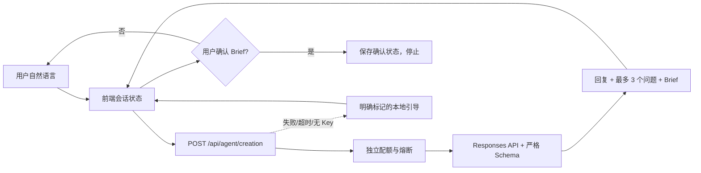

# 3D 创作 Agent 架构（M1.14a）

## 产品定位

“3D 创作 Agent”不是新的文生 3D 按钮，而是生成链路前的需求理解层。它把“我想做一个模型”这类模糊表达，逐步整理为用户可读、可修改、可确认的创作 Brief。

M1.14a 只实现需求澄清，不自动调用生图、三视图、Hi3D、拆件或几何工具。

## 当前数据流

## 前端状态

- 对话消息：最近 24 条保存在浏览器本地；发给模型时只保留最近 12 条。
- Brief：创作对象、模型类型、用途、风格、目标高度、姿态、拆件数量偏好和备注。
- 问题：每轮最多 3 题；每题 2–4 个互斥选项；推荐项最多 1 个。
- 确认：必须由用户点击“确认创作需求”；编辑任意 Brief 字段会解除确认。
- 降级：AI 不可用时显示“本地引导 · 未调用大模型”，不把规则判断伪装成 Agent 输出。

## 后端权限

| 能力 | M1.14a 权限 |
| --- | --- |
| 读取本轮文本、最近对话、当前 Brief、参考图数量 | 允许 |
| 返回结构化问题和 Brief | 允许 |
| 保存第三方模型响应 | 禁止，`store:false` |
| 接收或返回 API Key | 禁止 |
| 调用生图、三视图或 3D 生成 | 禁止 |
| 调用 Hi3D 拆件 | 禁止 |
| 修改场景或几何 | 禁止 |
| 自动确认需求 | 禁止 |

## 服务配置

默认使用 `CREATION_AGENT_PROVIDER=aihubmix` 和 `CREATION_AGENT_MODEL=gpt-5.6-sol`；未单独配置时后端可继承旧拆件分析的 Provider/模型和对应 Worker Secret。Provider 仍使用固定白名单 `openai | aihubmix`。

创作对话使用独立 `creation-agent` 配额域，默认单访客 20 轮/日、全站 500 units/日。上游失败会返还本轮配额。

## 后续阶段（未实现）

1. Brief 确认后生成 2–3 套效果图方向，用户再次确认。
2. 生成或校验正、侧、后三视图一致性。
3. 用户确认后调用图生 3D；保留失败重试和费用确认。
4. 生成结果进入已有编辑、拆件、连接件、检查、修复、排盘和导出链路。

每个付费或改模节点继续使用“预览—确认—执行—历史—撤销”的权限模式，不能由一次总授权贯穿整条链路。
