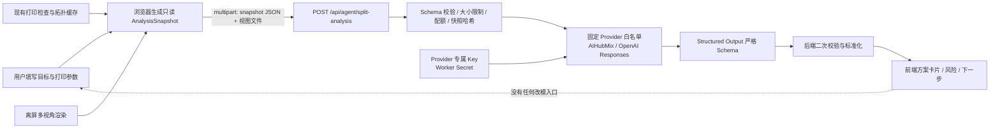

# 3D-STD 渐进式拆件 Agent 架构

| 项 | 内容 |
|---|---|
| 文档版本 | v0.5 |
| 日期 | 2026-07-23 |
| 状态 | M1.7.5 已提供用户显式触发的可调轴向候选、可行区间与 GPU 只读预览；完整阶段二工具循环和真实切割仍未开放 |
| 第一阶段 | 单 Agent、Responses API、只分析不改模 |
| 后续评估 | 阶段二继续优先评估 Responses API 工具调用；阶段三评估 Agents SDK 的审批、状态与追踪能力 |

## 0. 结论与边界

1. **阶段一直接使用 Responses API 最合适。** 它是一次多模态分析请求：服务端提交结构化事实、多视角图片和严格输出 Schema，不需要工具循环，也不需要 Agents SDK。
2. **阶段二仍可先用 Responses API function calling。** 当前只有一个拆件专家和 5 个只读/预览工具，由 3D-STD 自己控制最多调用次数、工具白名单和预览生命周期，复杂度可控。
3. **阶段三再评估 Agents SDK。** 它的价值不是“多 Agent”，而是可恢复的工具循环、人工审批暂停、guardrails、session 和 tracing。即使采用 SDK，仍保持单 Agent，不做专家分工或自动 handoff。
4. **模型永远不直接编辑 Three.js 场景或网格。** 模型只输出建议或工具调用意图；几何计算、权限校验、预览、确认、写历史和撤销都由 3D-STD 的确定性代码负责。
5. **第一阶段不向模型发送原始 STL/OBJ/GLB 或顶点数组。** 原始几何留在浏览器/几何服务内，只发送计算后的指标、对象关系和压缩多视角图。
6. **Provider Key 只允许存在于后端 Secret。** AIHubMix 使用 `AIHUBMIX_API_KEY`，官方 OpenAI 使用 `OPENAI_API_KEY`；两者不自动混用，也不复用浏览器 `x-engine-key` 通道，不写入源码、Git、localStorage、IndexedDB、日志或浏览器响应。
7. **不训练或微调自有模型，也不做多 Agent。** 第一阶段通过确定性数据、严格 Schema、提示词版本和 Gold Set 评测提升质量；阶段二、三仍保持一个拆件专家。

## 1. 当前项目哪些数据可以交给大模型

### 1.1 已有且可以直接结构化的数据

| 数据 | 当前来源 | 可用性 | 发送口径 |
|---|---|---:|---|
| 打印空间 | [`src/state/store.ts`](../src/state/store.ts) 的 `BedConfig` | 已有 | `x/y/z`，单位统一为 mm |
| 对象数量与层级 | [`src/kernel/scene.ts`](../src/kernel/scene.ts) 的 `nodes`、组、父子关系 | 已有 | 区分全部、可见、选中范围 |
| 当前选择 | `SceneDocument.selection` | 已有 | 只发送稳定对象 ID 与范围，不发送内部对象引用 |
| 对象名称、可见、锁定 | [`src/kernel/types.ts`](../src/kernel/types.ts) | 已有 | 名称视为不可信用户文本，只作为数据，不拼进 developer 指令 |
| 位置、旋转、缩放 | `InstanceNode.transform` | 已有 | mm / degree / ratio，固定 XYZ 顺序 |
| 模型本地包围盒 | `AssetMeta.bbox` | 已有 | 本地坐标 min/max |
| 世界包围盒和尺寸 | [`src/check/check-core.ts`](../src/check/check-core.ts) 的 `worldStats` 与检查结果 | 已有 | 世界坐标 min/max 和三轴尺寸 |
| 面数、焊接顶点数 | `AssetMeta`、`AssetAnalysisMeta` | 已有 | 逐资产；同资产多实例不重复 |
| 水密、退化面 | `weldAndAnalyze`、`AssetAnalysisMeta` | 已有 | 逐资产结论和计数 |
| 开放边界、非流形边 | `boundaryEdges`、`nonManifoldEdges` | 已有 | 逐资产计数 |
| 超打印空间 | `CheckIssue.code = out_of_bed` | 已有 | 逐实例，带世界包围盒 |
| 整件离床 | `CheckIssue.code = floating` | 已有 | 必须命名为“整件离床”，不能冒充局部过悬分析 |
| 微小件 | `CheckIssue.code = tiny` | 已有 | 逐实例、带当前阈值 |
| 当前检查状态 | [`src/check/check-state.ts`](../src/check/check-state.ts) | 已有 | `fresh/stale/partial/timeout/not_run`，不得把过期结果当当前事实 |
| 场景编辑版本 | `SceneDocument.editVersion` | 已有 | 用于绑定分析结果与场景快照 |
| 单资产轴测缩略图 | [`src/importer/thumbnail.ts`](../src/importer/thumbnail.ts) | 已有 | 144px，仅作补充，不能替代正式多视角图 |
| 透视/正交与相机预设 | [`src/viewport/CameraRig.tsx`](../src/viewport/CameraRig.tsx) | 已有 | 可作为多视角截图管线的基础 |
| 操作历史摘要 | [`src/kernel/history.ts`](../src/kernel/history.ts) | 已有 | 只发送最近少量“操作类型 + 目标名”，不发送 apply/revert 闭包 |

### 1.2 需要新增 UI 或快照适配器的数据

| 数据 | 第一阶段做法 |
|---|---|
| 用户拆件目标 | 新增文本框，限制 1000 字；另提供“放入打印空间 / 减少支撑 / 保强度 / 保表面 / 易装配 / 易打印”优先级标签 |
| 打印方式 | 新增 `FDM / SLA / SLS / 其他 / 未知`；第一阶段至少必填打印方式 |
| 喷嘴、层高、材料、装配间隙 | 可选参数；未知时显式传 `null`，不让模型自行猜测 |
| 当前零件与拆件状态 | 第一阶段把每个原始实例映射为 `original part`；组只标为 `group`，不能声称已进行几何合并或拆分 |
| 正式多视角截图 | 新增确定性离屏渲染：前、左、右、顶、轴测，默认 4 张、每张 512–768px |
| 薄壁结果 | 当前没有；第一阶段传 `unavailable`，不能用视觉图片代替厚度测量 |
| 局部过悬结果 | 当前没有；第一阶段传 `unavailable`。现有 `floating` 只表示整个实例离开床面 |

### 1.3 禁止发送的数据

- `AIHUBMIX_API_KEY`、`OPENAI_API_KEY`、`TRIPO_API_KEY`、Turnstile Secret、用户自带 API Key。
- 原始模型文件、完整顶点/索引数组、材质贴图，除非未来有单独的数据授权设计。
- IP、原始浏览器指纹、配额账本、Durable Object 内部键。
- 历史记录中的函数闭包、IndexedDB 二进制资产、未脱敏日志。
- 与本次选定范围无关的隐藏对象图片或几何摘要。

## 2. 哪些已有功能可以封装成 Agent 工具

### 2.1 阶段二工具映射

| 工具 | 可复用的现有能力 | 当前成熟度 | 仍需实现 |
|---|---|---:|---|
| `inspect_model` | `SceneDocument`、`geometryRegistry`、`worldStats`、`runPrintCheck`、检查缓存 | 高 | 统一只读快照、范围参数、结果版本与超时协议 |
| `find_cut_candidates` | M1.7.5 已有世界 AABB、打印床、X/Y/Z 轴向候选、10%–90% 可调位置和双侧入床区间 | 中低 | 自动偏移搜索、真实截面轮廓、自然接缝、薄颈、强度与细节损伤评分 |
| `preview_plane_cut` | M1.7.5 已有独立 PreviewStore、失效规则、GPU 双侧裁剪、实时 A/B 指标和每轴临时位置 | 中低 | 真实求交、封口、闭合临时派生网格、剖面轮廓、稳定 previewId/hash |
| `compare_split_schemes` | 当前检查项、打印空间、对象尺寸 | 中低 | 统一方案指标、确定性排序、支撑/强度/表面/装配评分 |
| `analyze_print_orientation` | 旋转、精确世界包围盒、床适配 | 中低 | 多候选朝向、接触面积、过悬面积、稳定性和支撑代理指标 |

`inspect_model` 最接近“封装即可用”。M1.7.5 已把 `find_cut_candidates` / `preview_plane_cut` 的可调轴向基线做成用户显式触发的本地能力，但还不是 Agent 后端工具循环，也不能代替真实切割几何。

### 2.2 阶段三工具映射

| 工具 | 可复用基础 | 判断 |
|---|---|---|
| `apply_plane_cut` | `SceneDocument` 命令、历史快照、资产/实例入库 | 几何内核缺失；历史框架可复用 |
| `merge_parts` | 成组、导出时合并 | **成组与导出合并都不等于网格布尔合并**，需新增布尔并集与派生资产 |
| `add_alignment_pin` | 变换与历史 | 需新增销/孔参数化几何、布尔、间隙与碰撞规则 |
| `validate_parts` | 打印检查 Worker、拓扑与床体积检查 | 可复用约一半；需补薄壁、过悬、切面封口与每件可打印性 |
| `validate_assembly` | 对象变换、包围盒 | 需新增配准、间隙、干涉、缺件、装配方向和定位特征检查 |

现有历史管理器具备 `push/undo/redo/jumpTo`，场景命令具备快照式 apply/revert，这为阶段三提供了正确基础。但网格写操作必须新增“派生资产 lineage”，不能原地覆盖 `geometryRegistry` 中的源资产。

## 3. 还缺少哪些几何能力

按实现依赖排序；M1.7–M1.7.5 已补齐的基础能力同时标注，避免重复建设：

1. **多视角确定性渲染（基础已完成）**：阶段一已有前、右、顶、轴测离屏视图与视图 ID；图片哈希和阶段二可复用快照缓存仍缺。
2. **连通组件与表面区域分析（部分完成）**：M1.7.1 已有带预算的连通壳、内部壳、孤立碎片和自交诊断；M1.7.2 增加本地自交三角形对与逐条定位；M1.7.3 增加最多 24 壳、120,000 面的分色只读预览和逐壳聚焦。原始面片索引与局部坐标都不进入模型请求；组件邻接、薄颈、平坦区、曲率突变和自然接缝仍缺。
3. **真正的局部过悬分析**：按打印方向计算面法线、过悬角、过悬面积与连通区域；不能复用现有整件离床警告。
4. **薄壁分析**：基于双向射线、SDF 或体素距离场估算局部厚度，并结合打印方式、喷嘴/光固化参数给阈值。
5. **候选切面搜索（可调轴向基线已完成）**：M1.7.5 可比较世界 X/Y/Z 轴并在 10%–90% 调整位置，对 AABB 切后尺寸、床适配、双侧入床区间、剩余超限轴和切面面积代理值评分；仍需补自动偏移搜索、真实截面积、结构强度、细节损伤、可隐藏接缝和装配可达性。
6. **鲁棒平面切割（仅视觉预览）**：M1.7.5 的 clipping plane 只负责随位置实时分色显示，不产出几何；仍缺三角形分类、边求交、轮廓闭合、孔环识别、封口三角化、法线/绕序修复和属性继承。
7. **鲁棒布尔几何**：并集、差集、交集；需要评估浏览器 WASM 几何内核或后端几何服务，不能用 Three.js 渲染几何近似替代。
8. **定位销/孔生成**：直径、长度、倒角、插入方向、数量、避让、材料与工艺间隙；销和孔必须成对进入历史。
9. **装配验证**：部件配准、碰撞/干涉、最小间隙、切面匹配、定位特征完整性与装配路径。
10. **派生资产和副本策略（网格修复基础已完成）**：M1.7 已实现原资产保留、派生资产替换实例引用与原子撤销；切割多派生件的 `operationId`、`parentPartId`、几何哈希和归档状态仍缺。
11. **预览生命周期（可调轴向切面基线已完成）**：M1.7 已实现修复预览；M1.7.5 的切面 PreviewStore 已支持可丢弃、每轴临时位置、编辑版本/床配置失效和零历史。完整阶段二仍需 previewId/hash、工具审计与可恢复状态。
12. **大网格性能边界**：切割、布尔和厚度分析需在 Worker/WASM 或后端执行，支持超时、中止、进度与内存上限。

## 4. 阶段一前后端数据流



### 4.1 浏览器侧

1. 用户选择分析范围，填写拆件目标与打印方式。
2. 如果打印检查未运行或已过期，UI 先提示运行检查；用户也可在“证据不完整”状态继续。
3. `buildSplitAnalysisSnapshot()` 从 `SceneDocument`、`useCheck`、打印床和几何元数据生成不可变 JSON。
4. `captureAnalysisViews()` 生成默认 4 张视图：前、左、右、轴测。顶视图只在高度/床适配问题明显时增加。
5. 第一次提交前明确告知用户：结构化模型摘要和这些截图将发送给配置的大模型服务商进行分析。
6. 浏览器提交 `multipart/form-data`：
   - `snapshot`: `split-analysis-input.v1` JSON；
   - `view_front`、`view_left`、`view_right`、`view_iso`: 图片文件。
7. 浏览器请求中不携带任何 Provider Key，不允许新增类似 `x-openai-key` 的自带 key 通道。

### 4.2 Worker 侧

新增独立分析通道，不复用 Tripo 的 `Engine` 接口：

```text
worker/agent/split-types.ts
worker/agent/split-validate.ts
worker/agent/analysis-provider.ts
worker/agent/openai-responses-provider.ts
worker/agent/split-prompt.ts
worker/agent/split-cache.ts
```

推荐接口：

```ts
interface SplitAnalysisProvider {
  analyze(
    snapshot: SplitAnalysisInput,
    views: AnalysisView[],
    signal: AbortSignal,
  ): Promise<{ result: SplitAnalysisOutput; usage: UsageSummary }>;
}
```

Worker 必须按以下顺序处理：

```text
解析 multipart
→ 输入 Schema / 图片类型 / 数量 / 尺寸校验
→ 生成服务端 snapshotHash
→ 检查缓存与幂等 requestId
→ Turnstile / 用户日限额 / 全局费用熔断
→ 调用 Responses API
→ 处理 refusal / incomplete / timeout
→ 输出 Schema 二次校验
→ 返回标准化结果
```

Responses API 请求原则：

```ts
await openai.responses.create({
  model: env.OPENAI_AGENT_MODEL,
  store: false,
  input: [
    { role: 'developer', content: SPLIT_ANALYST_POLICY },
    {
      role: 'user',
      content: [
        { type: 'input_text', text: canonicalSnapshotJson },
        ...views.map((v) => ({ type: 'input_image', image_url: v.dataUrl, detail: 'low' })),
      ],
    },
  ],
  text: {
    format: {
      type: 'json_schema',
      name: 'split_analysis_v1',
      strict: true,
      schema: SPLIT_ANALYSIS_OUTPUT_SCHEMA,
    },
  },
  max_output_tokens: 1800,
});
```

第一阶段不传 `tools`。模型必须把 `unavailable/stale/partial` 当作能力缺失，不能从截图伪造薄壁厚度、过悬角、切面坐标或装配公差。

### 4.3 返回前端的服务端信封

```json
{
  "ok": true,
  "analysisId": "ana_...",
  "requestId": "req_...",
  "snapshotHash": "sha256:...",
  "sceneEditVersion": 42,
  "cached": false,
  "result": { "schemaVersion": "split-analysis-output.v1" },
  "usage": {
    "inputTokens": 0,
    "outputTokens": 0,
    "imageCount": 4
  }
}
```

不返回 OpenAI 原始响应头、请求头、API key、provider 调试内容或完整上游错误。前端收到的 `sceneEditVersion` 与当前版本不一致时，整份分析标为“已过期”。

## 5. 大模型结构化输入和输出 Schema

### 5.1 Schema 文件

- 输入：[split-analysis-input.schema.json](contracts/split-analysis-input.schema.json)
- 输出：[split-analysis-output.schema.json](contracts/split-analysis-output.schema.json)

输入 Schema 是前端 → Worker 的完整数据契约；M1.6.2 使用有总量上限的 JSON data URL 传输最多 4 张压缩证据图，`views[].viewId` 负责绑定。输出 Schema 直接作为 Responses API `text.format.schema` 的主体，所有对象都关闭额外字段，所有字段均为 required，真正可选的值用 `null` 或空数组表达。若后续图片体积增加，再切换为 multipart，不改变快照与输出契约。

### 5.2 输入关键设计

- `goal`: 用户自由描述 + 明确优先级，不让模型从一句话猜全部约束。
- `printing`: 工艺、打印空间和可选制造参数。
- `scene.editVersion`: 分析结果过期判断的事实源。
- `objects`: 当前范围内的对象、变换、尺寸和网格统计。
- `diagnostics`: 明确区分新鲜、过期、部分、超时和未实现。
- `currentParts`: 记录原始件、组、预览件和派生件；第一阶段通常只有原始件/组。
- `views`: 仅描述图片证据；图片文件与该描述一一绑定。
- `capabilities`: 防止模型把“没检测”误写为“没有问题”。

### 5.3 输出关键设计

- `needsSplit`: `yes / no / uncertain`，而不是强迫二元结论。
- `reasons[].evidenceRefs`: 每个核心判断必须引用对象、检查项或视图证据。
- `recommendedRegions`: 第一阶段只允许自然语言地标和 0–1 归一化大致位置，不把视觉猜测包装成精确切面。
- `schemes`: 固定 2–3 套；可包含“不拆件基线方案”，便于比较。
- `impact`: 只给 `improved / neutral / worse / unknown`，暂不输出伪精确分数。
- `risks`: 风险与缓解措施分开表达。
- `nextSteps`: 第一阶段只能建议补数据、修网格、查看方案或进入预览，不能出现直接应用切割。
- `limitations`: 必须回传缺失输入、不可用能力、假设和视觉不确定性。

### 5.4 Developer 指令的最小权限规则

```text
你是 3D 打印拆件分析助手，只能分析和建议。
只使用输入中的事实和图片证据；能力为 unavailable/stale/partial 时明确说明。
不得声称已测得输入中不存在的厚度、角度、坐标、间隙或切割结果。
不得要求或输出 API key。
不得生成可执行的模型修改指令；下一步只能是补数据、修复、审阅或请求预览。
每个关键判断填写 evidenceRefs，输出必须匹配 split-analysis-output.v1。
```

## 6. Agent 权限表

| 阶段 | 模型可读 | 模型可调用 | 临时预览写入 | 持久几何写入 | 用户确认 | 历史/撤销 |
|---|---|---|---:|---:|---:|---:|
| 一：分析助手 | 快照 JSON、多视角图 | 无 | 否 | 否 | 不适用 | 不产生历史 |
| 二：只读与预览 | 快照、工具结果、预览图 | 仅 5 个白名单工具 | 是，独立 PreviewStore | 否 | 预览无需写确认 | 不产生场景历史 |
| 三：确认后执行 | 快照、预览、验证结果 | 读工具 + 写工具 | 是 | 仅审批后 | **每个写工具必须确认** | 每次写操作必须单独入栈并可撤销 |

### 6.1 工具级权限

| 工具 | 权限 | 阶段 | 约束 |
|---|---|---:|---|
| `inspect_model` | READ | 2–3 | 不返回原始顶点；返回版本化摘要 |
| `find_cut_candidates` | READ | 2–3 | 只计算候选，不生成场景节点 |
| `preview_plane_cut` | PREVIEW | 2–3 | 只写临时 PreviewStore，返回 `previewId` |
| `compare_split_schemes` | READ | 2–3 | 只能比较实际工具结果，不补造指标 |
| `analyze_print_orientation` | READ | 2–3 | 返回候选朝向和确定性指标 |
| `apply_plane_cut` | WRITE | 3 | 必须绑定未过期 `previewId` 和审批令牌 |
| `merge_parts` | WRITE | 3 | 必须先有布尔合并预览；组操作不可冒充合并 |
| `add_alignment_pin` | WRITE | 3 | 必须先预览销/孔、方向和间隙 |
| `validate_parts` | READ | 3 | 对派生件运行；不自动修复 |
| `validate_assembly` | READ | 3 | 不自动移动或吸附零件 |

### 6.2 写工具审批票据

Agent 不能生成或批准自己的确认。UI 展示预览后，由 3D-STD 后端签发一次性审批票据：

```json
{
  "approvalId": "apr_...",
  "previewId": "prv_...",
  "sceneEditVersion": 42,
  "snapshotHash": "sha256:...",
  "operation": "apply_plane_cut",
  "argumentsHash": "sha256:...",
  "expiresAt": "2026-07-21T12:00:00Z",
  "singleUse": true
}
```

执行前再次校验：票据未过期、未使用、操作与参数完全一致、场景版本未变化、源资产仍存在。任何一项不符都返回“预览已过期，请重新预览”。

### 6.3 原始模型保护

- 写工具对源 `BufferGeometry` 做 copy-on-write，生成新的派生资产与实例。
- 原始资产继续保留在资产库中，默认隐藏或归档，不允许原地覆盖。
- 一次“应用切割”作为一个原子历史条目：撤销删除全部派生件并恢复源实例；重做恢复同一批派生件。
- 后续销孔、合并等操作继续形成 lineage，不把多步几何写入折叠成无法解释的一次覆盖。

### 6.4 浏览器工具桥

当前真实几何只存在于浏览器 `geometryRegistry` / IndexedDB，后端 Agent 无法也不应该假装能直接调用浏览器函数。阶段二、三需要一层显式工具桥：

```text
Agent run 在 Worker/Agents SDK 暂停并返回 tool_request
→ 浏览器校验 runId、callId、工具白名单、sceneEditVersion
→ 本地 Worker/WASM 执行只读或预览几何工具
→ 浏览器上传小型结构化结果/预览哈希，不上传原始网格
→ 后端把 function_call_output 续回 Responses API/Agents SDK
```

- `tool_request` 必须带签名、过期时间、调用次数预算和参数 Schema 版本。
- 阶段二的预览资产只留在浏览器 PreviewStore；后端只持有 `previewId + hash + metrics`。
- 阶段三用户点击确认后，后端 Agent run 先进入 approval pause；审批票据返回浏览器，再由本地确定性工具执行写操作和历史入栈。
- 如果未来加入账号协作、云端资产或跨设备继续编辑，本地工具结果不再足够可信；届时需把几何副本送入受控的后端几何服务。本方案不提前引入这项复杂度。

## 7. 失败、超时和离线降级方案

| 场景 | 后端行为 | 前端体验 | 是否收费/重试 |
|---|---|---|---|
| 输入 Schema 不合法 | 400，本地拒绝 | 定位缺失字段 | 不调用模型 |
| 图片缺失或过大 | 400 | 提示重新截图 | 不调用模型 |
| 检查未运行/已过期 | 允许带状态提交 | 显示“证据不完整”，降低可信度 | 用户可先重跑检查 |
| OpenAI 401/403 | 503 `agent_unconfigured` | “AI 分析服务未配置” | 不向浏览器暴露上游细节 |
| 429 或 5xx | 指数退避 + 抖动，最多重试 1 次 | “服务繁忙，可稍后重试” | 幂等 requestId 防重复计费展示 |
| 请求超时 | `AbortController` 中止 | 保留用户输入，提供重试 | 不自动无限续跑 |
| refusal | 返回明确 `refused` 类 | 显示无法分析，不伪造空方案 | 不做格式修复重试 |
| incomplete / token 上限 | 返回 `incomplete` | 建议缩小分析范围 | 最多一次更小输出上限策略重试 |
| 输出 Schema 异常 | 后端拒收 | “结果格式异常” | 只允许一次同请求重试 |
| 场景在分析中被编辑 | 结果仍可返回但立即标 stale | 灰显，禁止进入预览 | 重新分析新快照 |
| 浏览器离线 | 不调用 API | 使用本地规则摘要 | 明确标“本地规则诊断，不是 AI 分析” |
| 全局费用熔断 | 429/503 统一错误 | “今日 AI 分析额度已用完” | 次日或管理员恢复 |

### 7.1 本地规则降级

离线模式只基于现有确定性事实生成有限提示：

- 任一轴尺寸超过打印空间：提示“需要改变朝向或考虑拆件”。
- 非水密、退化、非流形：提示“先修网格，再评估拆件”。
- 当前已有多个独立对象：提示“确认这些是否已是可独立打印零件”。
- 只有 `floating`：提示“对象整体离床，可先沉底；这不是局部过悬结论”。
- 薄壁和局部过悬不可用：显示“未检测”，绝不显示“通过”。

离线规则不输出推荐切面，不输出 2–3 套伪 Agent 方案。

## 8. API 费用控制方案

1. **不发送原始网格。** 百万级顶点先在本地转成几十 KB 的摘要。
2. **图片默认 4 张、384px JPEG、`detail: low`。** 只有评测证明必要时才提高分辨率或使用 `high`；不默认 `auto/original`。
3. **限制输出。** `max_output_tokens` 初始 3200；Schema 限制方案为 2–3 套，后续按真实输出截断率继续下调。
4. **快照缓存。** 缓存键：`snapshotHash + goalHash + printConfigHash + promptVersion + schemaVersion + modelConfig`。同一快照重复打开直接复用。
5. **请求幂等。** `requestId` 在服务端记录短期状态，前端重复点击不创建第二次调用。
6. **独立配额。** 不复用 Tripo credits 常量；新增“AI 分析次数 / 输入 token / 输出 token / 图片数”的独立账本和全局费用熔断。
7. **模型分层由评测决定。** `OPENAI_AGENT_MODEL` 与推理强度只放环境变量；先比较经济档和均衡档在固定拆件样本集上的准确率、延迟和成本，不把模型名硬编码到 UI。
8. **只在必要时升级。** 默认一次标准分析；“精细复核”是显式二次付费动作，UI 先提示会产生新调用。
9. **记录 usage。** 服务端按匿名用户、Schema 版本、模型配置记录 token 和图片数，不记录图片内容或 API key。
10. **项目级预算。** OpenAI 测试与生产使用不同 Project，分别设置 rate/spend limit 和告警阈值。

## 9. 需要新增或修改的文档

| 优先级 | 文档 | 动作 |
|---|---|---|
| 已完成 | 本文档 | 三阶段架构、权限、数据流、降级、费用与 MVP |
| 已完成 | `docs/contracts/split-analysis-input.schema.json` | 前端 → Worker 输入契约 |
| 已完成 | `docs/contracts/split-analysis-output.schema.json` | Responses API 严格输出契约 |
| P0 | `docs/prd-3d-studio-web.md` | 增加 AGT-01～AGT-12、UI 状态与阶段一验收标准 |
| P0 | `docs/tech-3d-studio-web.md` | 增加 Agent 服务边界、Secret、缓存、配额、存储与失败语义 |
| P0 | `docs/agent-tool-contracts.md` | 逐工具输入/输出、side effect、错误码、超时、版本和权限 |
| P0 | `docs/agent-eval-plan.md` | Gold Set、评分规则、幻觉检查、成本/延迟基线 |
| P0 | `docs/security-agent.md` | Prompt injection、图片/文本隐私、审批票据、审计和密钥轮换 |
| P1 | `docs/geometry-kernel-decision.md` | 浏览器 WASM 与后端几何服务选型、鲁棒性和许可证评估 |
| 每阶段 | `docs/releases/...` | 只记录真实上线能力，不把架构方案写成已完成产品 |

## 10. 最小可行版本任务拆解

阶段一 MVP 只交付“能基于真实数据给出可靠拆件建议”的产品闭环。

### 10.0 M1.6.1 实现快照

- 已完成 A2 的浏览器端 `AnalysisSnapshot` 原型：汇总场景、打印床、世界尺寸、对象数、拓扑问题和检查新鲜度。
- 已完成 A4、A7 的交互原型：拆件目标、打印方式、优先级、结构化结果、候选方案比较、风险与下一步。
- 已完成 A8 的 stale 与零副作用验证：场景或打印床变化后结果过期；分析不写场景和历史。
- 当前结果来自明确标识的本地 Mock，仅用于验证产品流程；A3 多视角截图、A5 Worker 端点、A6 Responses Provider、A9 配额缓存仍未实现。
- 阶段二“生成切割预览”保持禁用，阶段三写工具没有进入前端。

### 10.0.1 M1.6.2 实现快照

- A3 已完成：前、右、顶、轴测 4 张 384px 离屏 JPEG，固定低细节输入，不截图 UI/Gizmo。
- A5/A6 已完成：`/api/agent/split-analysis`、Worker Secret、部署配置 75 秒超时（代码默认 45 秒）、`store:false`、Structured Output、refusal/incomplete/坏输出分类。
- A7/A8 已完成：真实/降级来源标识、4 视角数量、stale 和本地规则降级；仍然不写场景与历史。
- A9 部分完成：独立单访客日限额、全站熔断和失败退款已实现；快照缓存、usage token 账本和持久幂等尚未实现。
- A10 工程安全测试已覆盖密钥不进入响应、非法证据前置拒绝、严格请求字段、失败退款和 UI 适配；prompt injection Gold Set 随 M1.6.3 完成。
- 阶段二按钮继续禁用；阶段三没有写工具、审批票据或几何修改入口。

### 10.0.2 M1.6.2.1 Provider 适配快照

- Provider 由服务端非敏感变量选择，仅接受 `openai` / `aihubmix`；上游 URL 来自代码内固定映射，不能由前端或任意环境地址覆盖。
- AIHubMix 和 OpenAI 使用各自独立 Secret；选择的通道缺少对应 Secret 时 fail-closed，不会偷用另一个 Key。
- 前端成功结果显示实际 Provider、模型和证据视角；发送前说明结构化场景摘要与多视角截图的数据流向。
- Responses 输入、strict Schema、`store:false`、只读权限、配额和本地降级保持不变。

### 10.0.3 M1.6.3 第一批实现快照

- 不再把模型 `nextSteps` 压成纯文本，保留顺序、动作标识、确认要求和建议工具，UI 以步骤卡呈现。
- 新增“立即可做”：可定位首个打印问题、打开打印检查、重新检查证据；这些动作由本地确定性代码执行，Agent 不获得写权限。
- `preview_plane_cut`、`analyze_print_orientation` 等未实现工具继续显示为阶段二禁用按钮，不把规划包装成能力。
- Worker 返回脱敏的响应耗时和 token 用量；前端显示真实遥测，Gold Set 用于 p95 延迟与成本比较。
- 新增 Gold Set 契约、5 个种子定义、自动评分器和人工 rubric；目标 24 个真实样本，未达门槛不进入 Agent 自动工具循环。M1.7 的用户主动确定性修复不授予 Agent 写权限。

### 10.0.4 M1.7.4 本地预览基线

- `find_cut_candidates` 的第一版由浏览器纯函数执行，只在有新鲜单壳超床证据时生成 X/Y/Z 三个中线候选；没有模型调用和 token 成本。
- `preview_plane_cut` 的第一版是 GPU 视觉裁剪与 A/B 包围盒指标，不生成闭合网格、封口或可导出零件；结果不得进入阶段三验证。
- AI 结果页只能在用户点击后打开本地预览，模型不自行循环调用工具；所有写工具仍不存在。
- 预览绑定源 `editVersion` 与打印床，过期即隐藏；候选切换、相机和关闭不写历史。
- 完整阶段二的进入门槛仍包括真实几何候选、稳定 previewId/hash、工具白名单协议、调用预算和 Gold Set 质量门槛。

### 10.0.5 M1.7.5 可调位置基线

- 用户可在每个 X/Y/Z 轴候选上显式调整 10%–90% 位置；25% / 50% / 75% 是 UI 快捷点，不是模型生成的方案。
- 每次调整由本地纯函数重算 A/B 包围盒、入床状态、剩余超限轴和双侧都能入床的可行区间；结果不经过 Worker 或第三方 API。
- 各轴临时位置分别保留，便于用户对照；任何调整都不修改 `SceneDocument`、资产、原始几何或历史。
- 该能力只缩短“手动比较轴向平面”的交互路径，不意味着 Agent 已能搜索自然接缝、验证真实截面或执行切割。

| 任务 | 交付物 | 依赖 | 验收重点 |
|---|---|---|---|
| A1 契约定稿 | 输入/输出类型、JSON Schema、错误码 | 无 | JSON 可解析；输出严格校验 |
| A2 AnalysisSnapshot | 从场景、床、检查结果生成不可变快照 | A1 | 同场景确定性一致；过期状态准确 |
| A3 多视角截图 | 前/左/右/轴测离屏截图与元数据 | A2 | 固定构图；不含 UI/Gizmo；图片尺寸受控 |
| A4 用户输入 UI | 目标、优先级、打印方式、可选制造参数 | A1 | 未知值不被强迫猜测；可恢复输入 |
| A5 Worker 端点 | `/api/agent/split-analysis`、校验、Secret、超时 | A1 | 浏览器请求/响应与 Git 中均无 key |
| A6 Responses Provider | 多模态输入、`store:false`、Structured Output | A5 | 无 tools；refusal/incomplete 正确分类 |
| A7 结果 UI | 是否拆件、理由、区域、2–3 方案、优缺点、风险、下一步 | A6 | 无“应用切割”按钮；证据与限制可见 |
| A8 stale 与离线 | 编辑版本绑定、本地规则摘要 | A2/A7 | 场景一改结果立即过期；离线不伪装 AI |
| A9 配额与缓存 | 幂等、快照缓存、日限额、全局熔断、usage | A5/A6 | 重复点击不重复调用；预算可观测 |
| A10 安全与测试 | 单测、路由测试、Schema 测试、prompt injection 样例 | A1–A9 | 名称/目标中的恶意文本不能提升权限 |
| A11 Gold Set 评测 | 20–30 个代表模型与人工标注 | A6/A7 | 需要拆件判断、方案可用性、幻觉率、成本、延迟 |
| A12 小流量上线 | 测试/生产 Project 分离、告警与回滚开关 | A9–A11 | 可一键切为本地规则降级 |

### 10.1 阶段一关闭标准

- 模型只收到授权范围的结构化摘要和最多 4–5 张压缩视图。
- 每次返回符合 `split-analysis-output.v1`，或返回明确的 refusal/incomplete/error。
- 结果稳定展示用户要求的全部字段，并包含证据引用和能力限制。
- 分析前后 `SceneDocument.editVersion`、资产数、节点数和历史长度完全不变。
- 浏览器源码、请求、响应、localStorage、IndexedDB、Git 和日志中均找不到 `AIHUBMIX_API_KEY` 或 `OPENAI_API_KEY`。
- 场景变更后旧分析立即标记过期，不能直接进入阶段二预览。
- Gold Set 达到预先约定的准确率/幻觉率/成本/延迟门槛后，才进入阶段二。

### 10.2 阶段二/三的进入门槛

- 阶段二：几何候选和预览内核先通过确定性单测；Agent 只编排已验证工具。
- 阶段三：copy-on-write、原子历史、审批票据、工具审计和装配/零件验证先独立通过，再开放任何写工具。
- 是否采用 Agents SDK 以“可恢复审批、tracing、guardrails 是否显著减少自研复杂度”为评估标准，不以“Agent”这个名称本身为理由。

## 11. 官方 API 依据

- [Responses API 与 Agents SDK 的选择](https://developers.openai.com/api/docs/guides/agents)：官方建议需要自己控制交互、工具、状态和编排时使用 Responses API；需要 SDK 管理循环、审批、guardrails、session 和 tracing 时使用 Agents SDK。
- [Structured Outputs](https://developers.openai.com/api/docs/guides/structured-outputs)：Responses API 可使用 `text.format` + 严格 JSON Schema；对象需关闭额外字段，字段需标为 required。
- [Images and vision](https://developers.openai.com/api/docs/guides/images-vision)：一次请求可包含多张图；图片计入 token，`detail` 会影响成本和分辨率。
- [Function calling](https://developers.openai.com/api/docs/guides/function-calling)：阶段二可使用工具白名单、`tool_choice` 和 strict 参数 Schema；应用负责执行工具并把结果返回模型。
- [Production best practices](https://developers.openai.com/api/docs/guides/production-best-practices)：API key 应保存在环境变量或 Secret 管理服务中；测试和生产项目应隔离并设置限额。
- [API 数据控制](https://platform.openai.com/docs/models/default-usage-policies-by-endpoint)：实现时还需根据项目的数据保留设置审查 `store:false`、图片输入和组织级数据控制策略。
