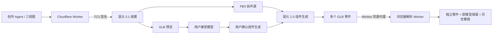

# 3D Studio M1.17a 开发记录

| 项目 | 内容 |
| --- | --- |
| 日期 | 2026-08-02 |
| 状态 | 已提交、上传并部署；生产实测发现 Worker `fetch` 绑定故障，已由 M1.17a.1 上传候选版修复 |
| 上一版本 | M1.16b |
| 主题 | 腾讯混元 3.1 成模与混元 1.5 组件生成闭环 |
| UI 档案 | `docs/ui-history/M1.17a/` |
| 规划记录 | `docs/releases/M1.17a-plan.md` |

## 用户问题与产品目标

M1.16b 已跑通“文字需求 → Brief → 视觉方案 → 效果图 → 三视图 → Hi3D 成模”，但 Hi3D 自动拆件多次在提交阶段失败，且 Hi3D 成模和拆件结果存在细节损失。M1.17a 的目标不是继续扩张功能，而是替换最后一段不稳定供应商链路，让已生成的模型能够在用户确认后进入真实组件生成，并将多个独立零件安全导回现有场景。

## 本版新增与修改

- 新增腾讯云 API 3.0 的 TC3-HMAC-SHA256 服务端签名客户端；
- 新增混元 3.1 文生 3D、单图生 3D、多视图生 3D 适配器；
- 生成固定使用 `Geometry + FBX`：GLB 用于浏览器预览，FBX 作为后续组件生成源；
- 新增混元 1.5 组件生成适配器，复用上一步供应商侧 FBX，不让浏览器重复上传网格；
- 组件结果通过同源清单返回，多个 GLB 逐个经 Worker 代理下载，不向浏览器暴露上游临时地址；
- 前端解析 Worker 支持多个 GLB，并合并导入为可独立选择、移动、隐藏和导出的场景零件；
- 原模型副本保留，接受拆件结果写入历史并支持撤销；
- 自动拆件面板根据资产来源显示“混元组件生成”或“Hi3D 自动拆件”；
- 对混元如实隐藏无效的“大部件/标准/细拆”选项，因为当前公开接口没有粒度参数；
- 混元取消只停止本地等待，不返还站内额度，避免把无法取消的上游任务错误表达为已退款；
- Hi3D 路径继续保留，供本地导入模型和回滚使用。

## 当前用户路径

1. 用户在创作 Agent 中完成效果图或三视图确认；
2. Worker 将文字、单图或多视图提交给混元 3.1；
3. 混元同时返回供前端预览的 GLB 和供组件生成复用的 FBX；
4. 用户接受 3D 结果，资产记录脱敏的供应商与生成任务 ID；
5. 用户主动点击“自动拆件”；
6. 面板明确显示混元组件生成将单独消耗 30 Credits，等待用户再次确认；
7. Worker 使用原生成任务查询 FBX，再提交混元 1.5 组件生成；
8. 成功后前端下载全部独立 GLB，导入场景并保留原模型；
9. 用户可检查、移动、隐藏或导出零件，也可通过历史撤销恢复拆件前状态。

## 技术架构

## 关键实现文件

- `worker/tencent-cloud-client.ts`：腾讯云 API 3.0 签名、请求与脱敏错误；
- `worker/hunyuan-engine.ts`：混元 3.1 生成、状态映射、GLB/FBX 结果选择；
- `worker/hunyuan-split-engine.ts`：混元 1.5 组件生成、结果列表与任务映射；
- `worker/engine.ts`：供应商选择与按供应商计费；
- `worker/router.ts`：生成/拆件路由、配额、退款、结果代理和错误边界；
- `src/split/auto-split-state.ts`：来源识别、任务轮询、多个零件导入、历史记录；
- `src/split/auto-split-result.worker.ts`：多个 GLB 的后台解析；
- `src/split/AutoSplitPanel.tsx`：混元与 Hi3D 两种真实能力的差异化说明；
- `tests/hunyuan-engine.test.ts`：签名负载与完整 Worker 契约测试。

## 接口与数据变化

- `ENGINE_MODE=hunyuan` 时，`/api/generate` 使用混元生成；
- 混元生成任务 ID 使用 `hy3d_` 前缀；组件任务 ID 使用 `hypart_` 前缀；
- 混元拆件提交使用 JSON：`sourceTaskId`、`level`、`turnstileToken`，其中 `level` 只为兼容现有状态结构，不传给供应商；
- Hi3D 拆件继续使用原 multipart STL 上传协议；
- `/api/split/:id/result` 对混元返回同源零件清单；
- `/api/split/:id/result/:index` 逐个代理 GLB；
- `EngineTask` 新增可选 `requestId`、`providerCode`；
- 资产 `genParams.split` 保存供应商、来源资产、任务 ID、零件序号和创建时间；
- SecretId/SecretKey 只允许存在 Cloudflare Workers Secrets，不进入前端、Git、日志或浏览器响应。

## 费用与安全护栏

- 混元 3.1 `Geometry + FBX` 预计 20 Credits/次；
- 混元 1.5 组件生成预计 30 Credits/次；
- 两次付费动作分别由用户确认，不自动串行扣费；
- 组件生成默认每日 2 次、全局 300 Credits 熔断，可通过 Worker 变量调整；
- 提交失败和任务失败走幂等退款；
- 混元当前没有取消 API，停止等待不退款，并在产品层明确区分“本地停止”和“上游取消”；
- 本轮实现没有发起新的真实付费请求。

## 真实供应商能力验证

在编码前已完成一次最小烟雾测试：

- 混元 3.1 成功生成 GLB + FBX；
- 该 FBX 成功提交混元 1.5 组件生成；
- 返回 3 个独立 GLB，文件头和模型结构检查通过；
- 烟雾测试产物保存在本地 `work/M1.17a-hunyuan-smoke-output/`，不进入发布包或 Git；
- 这项证据证明供应商 API 能力可用，不等同于前端生产闭环已经验收。

## 自动化验证

- `npm run typecheck`：通过；
- `tests/hunyuan-engine.test.ts`：2 项通过，覆盖签名负载、生成、FBX 复用、组件提交、结果清单、零件代理与取消不退款；
- 完整测试基线：76 个测试文件、552 项测试通过；
- `npm run build`：通过，714 个模块完成转换；
- 构建保留主包约 1.49 MB 的既有体积警告，未阻断发布候选版。

## 能力边界与已知问题

- 只有由混元生成、且生成任务 FBX 仍在 24 小时有效期内的资产可直接进入混元组件生成；
- 浏览器本地导入的 STL/OBJ/GLB 尚未转换和托管为 FBX，继续走 Hi3D 回退路径；
- 当前混元组件接口不提供拆件数量或粒度控制，不能承诺“大部件/标准/细拆”；
- 组件生成是供应商算法结果，不保证语义拆分、细节保持或可打印连接结构满足所有模型；
- 本版只生成独立零件，不自动添加榫卯、公差或装配关系；
- 页面刷新后的跨供应商旧任务恢复仍受当前单供应商运行模式限制；
- 已部署 M1.17a；生产健康接口、静态资源和只读组件入口已验证；
- 1920×1080、1366×768 本地 QA 入口及 1920×1080 生产入口截图已归档；真实运行与结果态仍待用户付费验收。

## Git、上传与部署

- 功能提交：`b3ae255`（`feat: add Hunyuan generation and component split`）；
- 远程分支：`origin/feature/split-analysis-api`；
- 远程上传：已执行；
- Cloudflare 生产地址：`https://3d-std.851241233.workers.dev/`；
- Cloudflare Worker 版本：`608af594-f8ea-49be-b9f7-e2264bad5ee8`；
- 生产健康接口：`engineName=hunyuan`，支持 `text,image,multiview`；
- 线上静态资源：`/assets/index-DxnORAIC.js`，与本地构建 SHA-256 一致并包含 M1.17a/混元 1.5 组件入口；
- 生产只读截图：`docs/ui-history/M1.17a/03-production-entry.png`；
- 部署验收没有提交生成或组件任务，没有产生付费调用。

## 回滚

- 将 `wrangler.jsonc` 的 `ENGINE_MODE` 恢复为 `hi3d`；
- 保留混元文件与 Secrets 不影响 Hi3D 路径；
- 不删除历史资产和版本记录；
- 若生产点测失败，可回滚静态资源与 Worker 到 M1.16b 已记录版本。

## 下一步

1. M1.17a 生产实测在创建腾讯云任务前触发 `Illegal invocation`，没有获得 JobId，站内额度已返还；
2. 根因和热修复见 `docs/releases/M1.17a.1.md`；
3. 部署 M1.17a.1 后重新验证一次混元生成和组件生成，再进入 M1.17b 的体验/UI 收敛。
