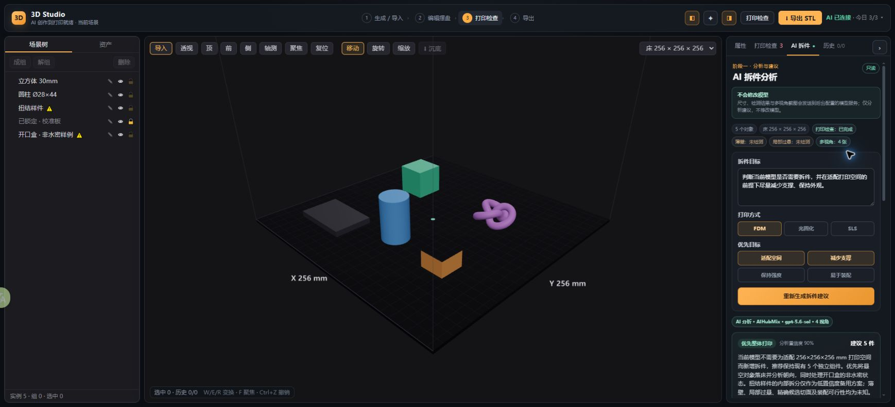

# 3D Studio M1.6.2.1 版本记录

| 项 | 内容 |
|---|---|
| 版本 | M1.6.2.1 |
| 日期 | 2026-07-22 |
| 上一版本 | M1.6.2 Responses API 只读闭环 |
| 范围 | AIHubMix Provider 接入、官方 OpenAI 回滚、来源透明与 Secret 隔离 |
| 状态 | 已上传、部署并完成 AIHubMix API 与外部 Chrome 真链验收 |

## 本版变化

1. 拆件分析新增 `openai` / `aihubmix` 双 Provider，生产默认切换为 AIHubMix。
2. 上游地址由 Worker 内固定白名单决定，浏览器不能提交或覆盖任意 API 地址。
3. AIHubMix 使用独立 Cloudflare Worker Secret `AIHUBMIX_API_KEY`；原 `OPENAI_API_KEY` 保留为回滚通道。
4. 选择的 Provider 缺少自己的 Secret 时直接安全失败，不会自动尝试另一个 Key。
5. 前端提交前说明会发送尺寸、检测结果和多视角截图；结果头显示 Provider、模型和证据视角数。
6. 原有 strict JSON Schema、`store:false`、低细节图片、45 秒超时、日配额、熔断、失败退款和本地降级保持不变。

## 权限与隐私边界

- 第一阶段仍然只有分析建议权限，不提供工具调用、预览切割或模型写操作。
- 浏览器只请求本站 `/api/agent/split-analysis`；两个 Provider Key 都不能进入前端代码、Git、浏览器请求或响应。
- 当前请求会把授权范围内的结构化场景摘要与最多 4 张压缩多视角图发送到已配置 Provider；UI 已明确告知这一点。
- 第三方 Provider 的数据处理与可用性风险独立于 3D-STD，正式商用前仍需完成隐私条款、日志保留和服务稳定性审核。

## 自动验证

- 双 Provider 单元测试覆盖固定端点、独立 Secret、错误 Provider 和缺失 Secret 的 fail-closed 行为。
- OpenAI 回滚路径继续覆盖 strict Schema、`store:false`、低细节图片、密钥不回显和失败退款。
- 前端 SSR 测试覆盖 AIHubMix 来源标签和发送前的数据说明。
- TypeScript 类型检查与生产构建通过；全量自动化 38 个测试文件、389 项全部通过。
- 生产构建仅保留主包超过 500 kB 的既有非阻断提示。

## 部署验收

1. Cloudflare Secret 中配置 `AIHUBMIX_API_KEY`，代码和日志不得打印它。
2. 部署后运行一次带 4 视角的真实分析，结果头应显示“AI 分析 · AIHubMix · gpt-5.6-sol · 4 视角”。
3. 检查返回 2–3 套候选方案、风险、限制和下一步；历史与场景不得被修改。
4. 浏览器 Network 中只能看到本站端点，且请求与响应都不得出现任何 Provider Key。
5. 将 `SPLIT_ANALYSIS_PROVIDER` 临时切为 `openai` 可回滚；未切换时不得调用官方 OpenAI 地址。

## 线上验收结果

- GitHub `main` 已包含提交 `284edf7`，Cloudflare 已从旧资源 `/assets/index-tEUoy5tg.js` 切换到 `/assets/index-Bxhzfiyv.js`。
- `AIHUBMIX_API_KEY` 已写入 Cloudflare Worker Secret；仓库内容反查为 `0` 个密钥匹配。
- 线上最小合法请求返回 `HTTP 200`：`provider=aihubmix`、`model=gpt-5.6-sol`、`needsSplit=no`、3 套结构化方案。
- 外部 Chrome 使用示例场景完成 4 视角真链：结果头显示“AI 分析 · AIHubMix · gpt-5.6-sol · 4 视角”，推荐保持现有 5 件，并提供备用拆分方案。
- 分析前后操作历史保持 `0/0`；“生成切割预览 · 阶段二”继续禁用；页面控制台错误为 0。
- 官方 OpenAI 回滚通道由自动化测试验证；本次未切换生产 Provider，避免为验证回滚再次消耗真实调用。

## UI 版本记录

### AIHubMix 四视角真实结果态

## 下一步

进入 M1.6.3：用 20–30 个真实模型建立 Gold Set，评估判断准确性、方案可用性、幻觉率、延迟和单次成本，并把文字建议逐步转化为可定位、可预览、可确认的 UI 操作提示。
