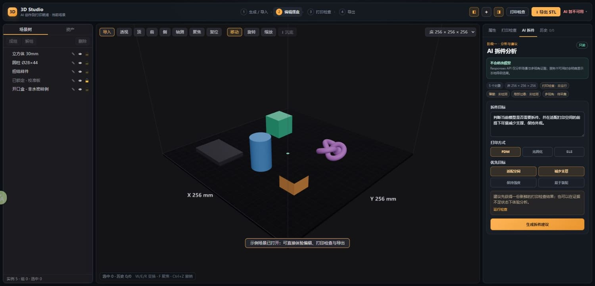
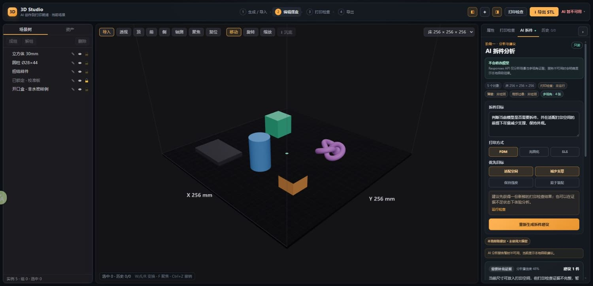

# 3D Studio M1.6.2 版本记录

| 项 | 内容 |
|---|---|
| 版本 | M1.6.2 |
| 日期 | 2026-07-21 |
| 上一版本 | M1.6.1 AI 拆件分析只读 Mock 原型 |
| 范围 | Responses API 单 Agent 只读闭环、4 视角证据、结构化输出、费用护栏与明确降级 |
| 状态 | 已上传并部署；线上安全降级已验证，Cloudflare `OPENAI_API_KEY` 尚未配置，真实 AI 暂未启用 |

## 本版新增

1. 新增 `POST /api/agent/split-analysis`，只负责分析，不提供任何模型写工具。
2. 浏览器从当前可见实例生成前、右、顶、轴测 4 张 384 × 384 JPEG 离屏截图，不改变实时相机、选择或场景。
3. 请求包含用户目标、打印方式、打印空间、对象/零件状态、变换、尺寸、面/点数、打印检查、拓扑问题和能力可用性。
4. Worker 调用 OpenAI Responses API，默认模型 `gpt-5.6-sol`、推理强度 `low`、`store:false`、视觉 `detail: low`。
5. 模型输出必须符合 `split-analysis-output.v1` 严格 JSON Schema，固定返回 2–3 套候选方案。
6. 前端将富 Schema 映射到现有候选方案 UI，并显示真实模型名和使用视角数。
7. Secret 缺失、离线、超时、refusal、incomplete、上游失败或坏输出时，自动生成本地规则建议，并明确标注“未使用大模型”。
8. 分析使用独立 Durable Object 配额：单访客默认 3 次/日、全站 100 单位/日、上游失败自动退款，不占用 Tripo credits。

## 安全与权限边界

- `OPENAI_API_KEY` 只从 Cloudflare Worker Secret 读取；前端不接受、不存储、不回显该 Key。
- Worker 只向浏览器返回结构化结果、模型名、requestId 和视角数，不返回上游原始响应、请求头或调试内容。
- 单次请求最多 40 个对象、160 条问题、4 张图；单图不超过 600KB，图片总量不超过 2MB，请求声明体积不超过 3MB。
- 阶段一无工具调用、无切割、无零件生成、无历史写入；阶段二预览入口继续禁用。
- 模型只能引用请求中真实存在的 objectId、assetId、issueId 和 viewId；缺失能力必须标为未知。

## 失败与费用控制

- 服务端超时默认 45 秒，前端总超时 50 秒。
- 验证失败发生在扣费前；上游失败在独立账本中退款。
- 429、超时、拒绝、结果不完整和坏结构均有稳定错误码，UI 统一收敛为可解释中文提示。
- 当前没有快照缓存、usage token 账本和持久请求幂等；M1.6.3 根据真实流量与 Gold Set 成本决定是否增加。

## 自动验证

- TypeScript 全项目检查通过。
- 全量自动化：38 个测试文件、386 项测试通过。
- 新增 Worker 测试覆盖：Secret 仅上行、`store:false`、strict Schema、`detail: low`、前置校验、失败退款、日限额与全站熔断。
- 生产构建通过；主包超过 500 kB 的既有非阻断提示仍存在。
- 外部 Chrome 本地验收：示例场景采集 4 张视角；服务不可达时显示产品化中文降级；历史保持 `0/0`。
- 生产资源已切换到 `/assets/index-tEUoy5tg.js`；线上端点返回 `503 split_analysis_unconfigured`，证明新路由已上线且 Secret 缺失时 fail-closed。

## UI 版本记录

### 分析输入态

### 服务不可达时的明确降级结果态

## 部署后手测

1. 在 Cloudflare Worker Secret 中确认 `OPENAI_API_KEY` 存在并重新部署；不要把值写入仓库或聊天。
2. 打开示例场景，进入“AI 拆件”，运行打印检查后生成建议。
3. 结果头应显示“AI 分析 · gpt-5.6-sol · 4 视角”；若显示本地降级，按提示区分 Secret、额度、网络或上游问题。
4. 检查 2–3 套方案、风险、限制和下一步完整；不应出现可用的“应用切割”动作。
5. F12 Network 确认浏览器只请求本站 `/api/agent/split-analysis`，且任何请求/响应里都没有 OpenAI Key。
6. 切换打印床或移动对象，确认结果立即过期；打开历史，确认分析没有新增记录。

## 下一批

M1.6.3 建立 20–30 个真实模型 Gold Set，校准模型、推理强度、图片规格、输出上限、判断准确性、幻觉率、延迟和成本。达到门槛后再进入 M1.7 只读几何工具与切割预览。
